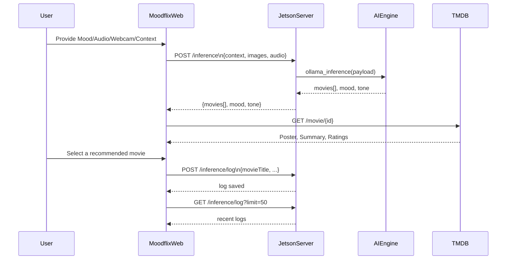
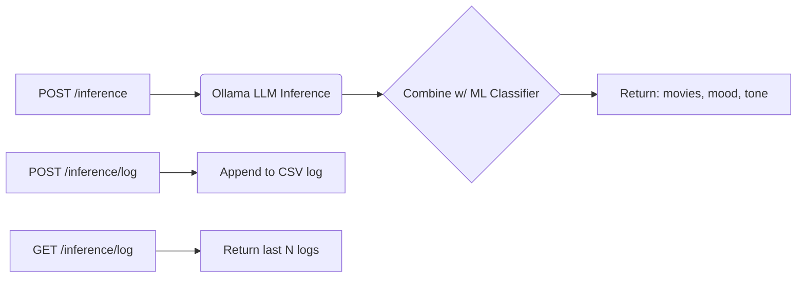

# MoodFlix: Multimodal Mood-Based Movie Recommendation Platform

MoodFlix is a full-stack web application that provides personalized movie recommendations powered by a multimodal AI engine. The system demonstrates modern networking and distributed systems principles by integrating RESTful HTTP, WebSocket streaming, and a robust API contract between the client and a server running on NVIDIA Jetson hardware.


----
<p align="center">
  
</p>


----


## 🏗️ System Architecture

**High-Level Flow:**  
1. **Client (React SPA):** Collects multimodal context (location, weather, webcam, microphone) and interacts via HTTP/WebSocket.
2. **Server (Python/Jetson):** Provides `/inference` and `/inference/log` HTTP endpoints for mood AI and logging.
3. **TMDB API:** Fetched by client to enrich movie details with real-time metadata.

---

## 📡 Networking Protocols
- **REST API** (`/inference`, `/inference/log`): For recommendation and logging.
- **WebSocket (optional, in experimental mode):** For real-time interactive streaming and inference feedback.
- **Custom Payload Format:** All client-server communication uses structured JSON (see below).

---

## 🔌 API Endpoints

| Endpoint             | Method | Purpose                                               |
|----------------------|--------|-------------------------------------------------------|
| `/inference`         | POST   | Submit multimodal mood context, get recommendations   |
| `/inference/log`     | POST   | Log user's selection/finalized feedback, environment  |
| `/inference/log`     | GET    | Fetch N latest logs (query: `limit`)                  |

Response/status codes and error schemas are documented in [README_SERVER.md](README_SERVER.md).

---

## ⚙️ Detailed Flowcharts

### Overall Data Flow (with Endpoints)



---

### Backend API Flow



---

## 🔬 Payload Formats

**POST `/inference`**  
```json
{
  "protocol": "MFNP",
  "version": 1.0,
  "sender": "client",
  "message_type": "inference",
  "payload": {
      "environment": {
      "city": "Seoul",
      "lat": "37.566",
      "lon": "126.9784",
      "weather_desc": "Cloudy",
      "temperature": "13.5",
      "weekday": "Sunday",
      "today_status": "Weekend",
    ...
  },
  "images": "<base64-encoded-frame>",
  "audio": "<base64-encoded-waveform>"
  }
}
```
**Response:**  
```json
{
  "protocol": "MFNP",
  "version": 1.0,
  "sender": "server",
  "message_type": "inference",
  "payload": {
      "movies": [ ... ],
      "primary_llm": [ ... ],
      "mood": "happy",
      "tone": "gentle"
  }
}
```

**POST `/inference/log`**  
Records the final selection plus context:
```json
{
  "protocol": "MFNP",
  "version": 1.0,
  "sender": "client",
  "message_type": "inference-log",
  "payload": {
      "clientSentAt": "2025-12-04T12:34:56Z",
      "movieTitle": "Minari",
      "env": {...},
      "mood": "happy",
      "tone": "gentle"
  }
}
```

**GET `/inference/log`**  
Fetches the last N entries for feedback analytics.
```json
{
  "protocol": "MFNP",
  "version": 1.0,
  "sender": "server",
  "message_type": "inference-log",
  "payload": {
      "clientSentAt": "2025-12-04T12:34:56Z",
      "env": {...},
      "mood": "happy",
      "tone": "gentle",
      "movieTitle": "Minari",
  },
  {
      "clientSentAt": "2025-12-04T12:34:56Z",
      "env": {...},
      "mood": "happy",
      "tone": "gentle",
      "movieTitle": "Texi driver",
  },
  ...
}
```

## 🖥️ Client Architecture (React, JavaScript)

- **Context Sensing:** Uses browser APIs, Geolocation, BigDataCloud, Open-Meteo for context.
- **Media Capture:** Webcam & microphone streams, converted to Base64 (see [`useWebcamCapture`](web-app/src/hooks/useWebcamCapture.js) & [`useAudioRecorder`](web-app/src/hooks/useAudioRecorder.js)).
- **Networking:** 
  - `sendInferenceRequest` in [`inferenceAPI.js`](web-app/src/api/inferenceAPI.js) for REST calls.
  - TMDB API (`tmdbApi.js`) for movie details.

*For more details, see [`web-app/README.md`](web-app/README.md).*

---

## 🧠 Server-Side Architecture (Jetson, Python)

- **Core:** REST server (`server.py`/`server2.py`) on NVIDIA Jetson.
- **AI Processing:** Calls **Ollama LLM** and local classifiers for hybrid recommendation.
- **Logging:** Immediate CSV write of feedback events and user sessions (see `user_logs.csv`).
- **Endpoints:** Precise docs in [`README_SERVER.md`](README_SERVER.md).

*For ML model/network design, see [`aiengine.py`](aiengine.py).*

---

## 🌐 Networking Features

- **Distributed Design:** (Planned) Multi-node protocol via `MFNP` message format, including hash-based file validation for user logs (see `server2.py`).
- **WebSocket Experimental:** Real-time signaling and inference streaming from client (see `CapturePage1.jsx`).

---

## ⚡ Tech Stack

- **Client:** React, Browser APIs, TMDB, BigDataCloud, Open-Meteo, WebRTC/Media Capture
- **Server:** Python 3, Flask/FastAPI/HTTPServer, Ollama (LLM), ML Model, NVIDIA Jetson hardware
- **Networking:** RESTful HTTP, WebSocket (optional), Custom JSON

---

## 🏗️ How to Run

**Client (React):**
```bash
cd web-app
npm install
npm start
```
**Server (Jetson):**
```bash
python server.py
# or for protocol experiments:
python server2.py
```

---

## 🔗 References

- [web-app/README.md](web-app/README.md) — Client setup/architecture
- [README_SERVER.md](README_SERVER.md) — Backend endpoint docs, logs, protocol
- [aiengine.py](aiengine.py) — ML/AI mood pipeline

---

## 🤝 Contributing

- Submissions for new endpoints, distributed network protocols, and improved feedback logging welcome!
- Please update diagrams and flowcharts for major design changes.

---

## 🔍 See also

> API details and more code:  
> [Browse MoodFlix on GitHub](https://github.com/Prithwis-2023/MoodFlix/)
